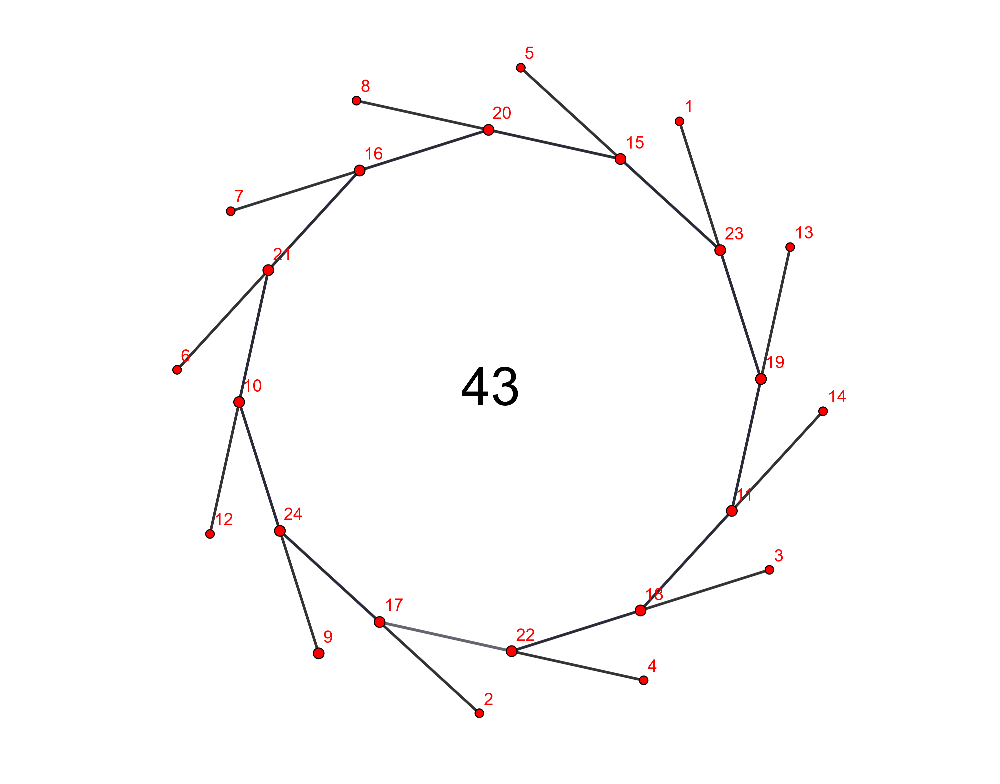

# What is project-euler?

https://projecteuler.net/

Repository tracking my solutions to the Project Euler problems.

-   Later problems: `C#`
-   Early problems (1 - 12): newbie `JavaScript`

# Motivation

At first I used JavaScript because I wanted to learn the language, thinking these would be easy problems and a good opportunity to **learn a language**. While that's certainly possible, it made it unnecessarily harder than just focusing on the algorithms while using a language I'm most comfortable with.

Another motivation was to go through some algorithmic exercises and learn more about **algorithms and data structures**.

The newest goal was to learn C# programming without Visual Studio using **VS Code** and **dotnet CLI**, and also start solving harder problems and **practice math**.

# AI tools, LLMs

At this point AI tools are able to solve the problems in seconds, giving the right answers, which leads me to question whether the skills I am learning through these exercises are actually valuable when these tools are now superior and faster at logical reasoning than I can ever hope to be.

Arguments to continue:

-   You need to understand it to verify it - but do you? Nowadays it is faster to test if it works
-   It is fun - well, only if your idea of fun isn't only happy emotions :D
-   Building intuition for mathematical concepts
-   The journey of discovery matters

In the end I am making use of the AI tools; it would be stupid not to. But I am also very careful about what I have it do for me so that I fully understand the problem and am able to solve it myself. I am now using it as a smart friend to help me learn and also as a fast generator of what I already know and can quickly verify that I understand what and how it's doing it and that it is what I want, in order to not miss out on any learning.

# What I learned

### Math and algorithms

-   **Number theory basics**: prime factorization, GCD, LCM, modular arithmetic
-   **Data type limitations**: int, long, double won't cut it every time - especially in edge cases dealing with large numbers - but C# BigInteger is very helpful
-   **Algorithm optimization**: brute-forcing is never a good algorithm, and with clever algorithms you can bring exponential time down to milliseconds
-   **Sieve of Eratosthenes**: efficient prime number generation
-   **Newton's method**: fast square root approximation and optimization techniques
-   **Performance vs. readability**: sometimes (most of the time) Math.Sqrt() beats custom optimizations
-   **Continued fractions**: representing square roots and finding convergents
-   **Pell's equation**: finding integer solutions to x² - Dy² = 1
-   **Collatz conjecture**: understanding iterative sequences
-   **Combinatorics**: permutations, combinations, and counting problems
-   **Dynamic programming**: optimising plain recursion

### Technology

-   **VS Code**
-   **GitHub Copilot**
-   **dotnet CLI**: command-line interface for .NET projects
-   **Git Bash (mingw64)**: is awesome - I prefer it to cmd and PowerShell on Windows

# Solved Problems

### Problem Categories Completed:

-   **1-12** 🟢 Prime numbers & Basic algorithms
-   **13** 🟢 Large sum computation
-   **14** 🟢 Collatz conjecture
-   **51** 🟢 Prime digit replacements
-   **64, 65, 66** 🟢 Continued fractions of square roots and convergents
-   **67** 🟢 Dynamic programming
-   **68** 🟢 Magic 5-gon Ring: My algorithm solves for N-gon, Permutation search, Symmetry reduction, Efficient enumeration
-   **69, 70** 🟢 Euler's totient function: Using the Sieve of Eratosthenes to efficiently generate values for all n <= 1,000,000, reducing O(N²) to O(NloglogN) hours -> miliseconds

### Problem 66

At first I tried it naively and found it wouldn't work - had to go back to 64 and 65 to learn concepts necessary for solving the problem. ChatGPT solved it in 10 seconds... But I learned a lot.

### Problem 68

I let my N-gon algorithm run for a dodecagon, and it found all solutions in under 13 minutes. This is an example with a total of 43.

